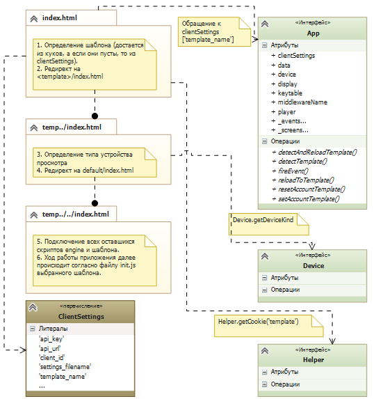

****************************************
Описание содержания и структуры `engine`
****************************************

Структурно engine состоит из следующих js-скриптов и каталогов:

* `app.js` - глобальное объявление и первоначальная инициализация приложения, всех его базовых сущностей, событий, клиентских настроек по умолчанию, а также методов определения и загрузки нужного шаблона интерфейса.
* `application.js` - скрипт, описывающий сущность BaseApplication - стороннее подключаемое приложение.
* `data.js` - сущность BaseData, набор функций, производящих общение с backend-частью платформы.
* `device.js` - объявление и определение класса Device, то есть методов работы с API устройства просмотра. Данный скрипт является родительским для всех остальных `device.js`, описывающих работу с каждым конкретным устройством, а также заглушкой для запуска портала в браузере - его методы вызываются в случае, если устройство просмотра не было определено и по умолчанию было задано как 'mag'. При попытке воспроизведения потока в браузере пользователь увидит эмулятор плеера, в остальном работа портала не будет отличаться от обычной.
* `display.js` - сущность BaseDisplay, представляет собой набор переменных и методов для задания и определения конфигураций дисплея, а также методы по работе с нажатиями клавиш и управления экранами (сущностями, наследуемыми от BaseScreen).
* `helper.js` - описание класса Helper, содержащего вспомогательные функции для работы с DOM-элементами, массивами, строками и т.д.
* `keytable.js` - сущность BaseKeyTable, класс для работы с таблицами кодов клавиш каждого устройства.
* `lang.js` - сущность BaseLang, позволяющая менять языковую локализацию приложения каждого шаблона.
* `logger.js` - класс Logger для работы с самописной консолью (предназначена только для debug-режима, активируется в файле client.js или с помощью *магической* комбинации клавиш, по умолчанию отключена).
* `menu.js` - сущность BaseMenu, описывающая поведение различных списков в приложении, а также предоставляющая широкий набор методов для работы с ними.
* `player.js` - сущность BasePlayer, является родительской для плеера внутри каждого шаблона, фактически описывает событийный аппарат плеера.
* `screen.js` - сущность BaseScreen, описывает экран приложения - структурную единицу любого шаблона.
* `settings.js` - сущность BaseSettings, содержит константы и методы для  работы с пользовательскими настройками приложения (язык, время, буфферизация и т.д.), которые в дальнейшем могут переопределяться в зависимости от шаблона. Набор настроек также кастомизируем с помощью файла client.js.
* каталог `backends` - содержит сторонние data.js, то есть наборы методов для работы со сторонними backend-ами.
* каталог `device` - содержит файлы device.js для каждого устройства, на данный момент их уже 14.
* каталог `thirdparty` - содержит сторонние библиотеки, на данный момент только json2.js.

* `client.js` - файл, содержащий настройки оператора ``clientSettings``.

Механизм определения шаблона
----------------------------

Как было описано выше, `engine` представляет собой ряд сущностей, составляющих костяк IPTV/OTT-сервиса. Все они, взаимодействуя друг с другом на протяжении сессии, образуют жизненный цикл приложения. Практически все данные, используемые сервисом - динамические, то есть они запрашиваются с сервера или высчитываются при каждом новом запуске (исключением, пожалуй, являются только данные авторизации и пользовательские настройки - они записываются в куки устройства).
Ниже представлена примерная схема, по которой происходит процесс инициализации приложения, определения шаблона, типа устройства просмотра и подключение и подгрузка нужных скриптов (другими словами, всё, что происходит до запуска init.js каждого шаблона).

Работа шаблона начинается с файла ``stb\index.html``.

1. На основе ``clientSettings`` и cookie-файлов определяется шаблон и производится редирект на ``stb\templates\<имя шаблона>\index.html``.

2. Определяется тип устройства и производится редирект на ``stb\templates\<имя шаблона>\default\index.html``.

3. Далее управление переходит файлу ``stb\templates\<имя шаблона>\default\media\js\init.js``.

Механизм инициализации устройства
---------------------------------

Механизм инициализации приложения
---------------------------------

Процесс авторизации
-------------------

Процесс запуска потока Live TV
------------------------------

Процесс запуска архивных передач
--------------------------------
